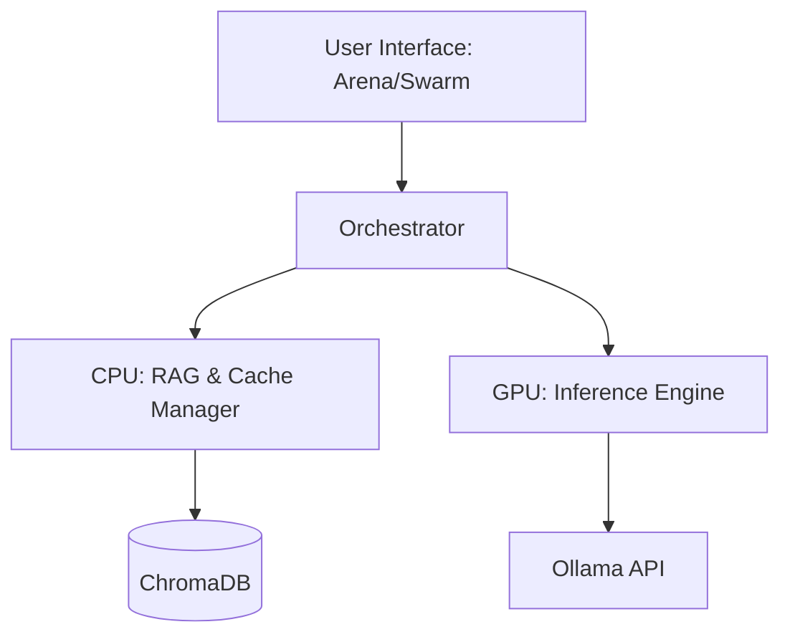

# 🤖 Local Agents RAG System

A local-first, high-performance **Agentic RAG System** designed for privacy, efficiency, and advanced reasoning. This system leverages **Ollama** and **ChromaDB** to provide a complete ecosystem for local LLM experimentation, benchmarking, and multi-agent workflows.

---

## 🚀 Overview

The **Local Agents RAG System** is not just another chat interface; it's a sophisticated orchestration layer that separates intensive tasks between CPU and GPU, ensuring optimal performance on consumer hardware. It features a dual UI experience: a benchmarking **Arena** and an agentic conversation **Swarm**.

## ✨ Key Features

### 🏟️ The Arena (Streamlit)
*   **Model Benchmarking**: Side-by-side comparison of local models.
*   **Resource Monitoring**: Real-time tracking of VRAM and system usage.
*   **Elo Rating System**: Automated ranking based on model performance in specific tasks.

### 🐝 The Swarm (Chainlit)
*   **Advanced Agentic Chat**: Multi-step reasoning and memory-enabled conversations.
*   **Hybrid Memory**: Persistent storage of context using ChromaDB.

### 🧠 Specialized Workflows (Orchestrator)
*   **PoetIQ (Cunningham’s Law RAG)**: A unique retrieval technique that generates a "plausible lie" (trap) to trigger more accurate fact correction from the vector database.
*   **Consensus Engine**: A "Council of Models" architecture where multiple small models (e.g., Gemma, Qwen) vote and a lead agent synthesizes the final consensus.
*   **Deep Reasoning Flow**: A systemic loop of **Decomposition ➝ Hypothesis ➝ Critique ➝ Verification** to minimize hallucinations and maximize accuracy.

### ⚡ Resource Optimization
*   **CPU Layer**: Handles document indexing, embedding generation (Sentence Transformers), and cache management.
*   **GPU Layer**: Focused exclusively on lightning-fast inference using Ollama.

---

## 🏗️ Architecture



---

## 🛠️ Installation

### Prerequisites
- **Python 3.10+**
- **Ollama** (Make sure the server is running)
- (Switching to a GPU is highly recommended for Inference)

### Steps
1.  **Clone the repository**:
    ```bash
    git clone https://github.com/Francisco-cor/Local-agents-rag-system.git
    cd Local-agents-rag-system
    ```

2.  **Install dependencies**:
    ```bash
    pip install -r requirements.txt
    # OR if using the provided pyproject.toml
    pip install .
    ```

3.  **Setup Environment**:
    Create a `.env` file in the root directory (refer to `.env.example`).

---

## 🎮 Usage

Launch the main hub to choose your interface:

```bash
python launcher.py
```

### Modes
1.  **ARENA**: Best for testing which model handles your specific data better.
2.  **SWARM**: Best for deep research, complex reasoning, and agent-assisted workflows.

---

## 🔬 Advanced Engine Mechanics

### Cunningham's Law RAG (PoetIQ)
Instead of searching for a query directly, the system generates a "common misconception" about the topic. By searching for the *correction* of that misconception, the retrieval process often finds more nuanced and factual context that standard semantic search might miss.

---

## 📄 License
This project is licensed under the **MIT License**. See the [LICENSE](LICENSE) file for details.

---

*Built with ❤️ for the open-source AI community.*
