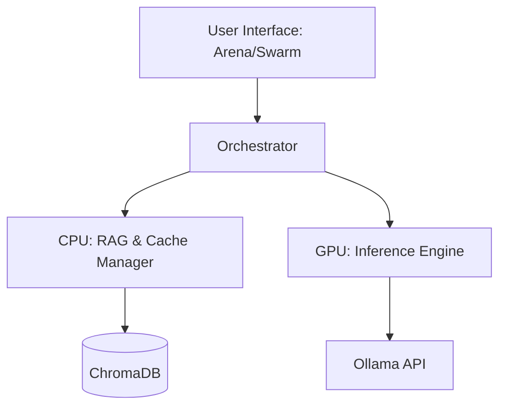

# Local Agents RAG System

A high-performance, local-first **Agentic Retrieval-Augmented Generation (RAG) System** developed for privacy, computational efficiency, and sophisticated reasoning. The system integrates **Ollama** and **ChromaDB** to provide a robust environment for local Large Language Model (LLM) experimentation, benchmarking, and multi-agent orchestration.

---

## Overview

The **Local Agents RAG System** serves as a sophisticated orchestration layer designed to optimize hardware utilization by segregating intensive tasks between CPU and GPU nodes. This architecture ensures peak performance on consumer-grade hardware. The system provides a dual-interface experience: a benchmarking **Arena** for model evaluation and an agentic **Swarm** for complex conversational workflows.

## Technical Highlights

### Model Benchmarking Arena (Streamlit)
*   **Performance Benchmarking**: Comparative analysis of local models in side-by-side configurations.
*   **System Telemetry**: Real-time monitoring of VRAM allocation and general system resource utilization.
*   **Automated Ranking**: An Elo-based rating system for objective model performance assessment across diverse tasks.

### Multi-Agent Swarm (Chainlit)
*   **Agentic Orchestration**: Advanced multi-step reasoning capabilities with managed conversational memory.
*   **Persistent Context**: Contextual data retention utilizing ChromaDB for long-term information recall.

### Advanced Reasoning Architectures
*   **PoetIQ (Cunningham’s Law RAG)**: A specialized retrieval strategy that leverages generated misconceptions to elicit higher-fidelity factual corrections from the knowledge base.
*   **Consensus Engine**: A "Council of Models" framework where multiple specialized models collaborate via voting, with a lead agent synthesizing the final output.
*   **Deep Reasoning Pipeline**: A systemic reasoning loop comprising **Decomposition, Hypothesis Generation, Critique, and Verification** to mitigate hallucinations and ensure factual integrity.

### Performance Optimization
*   **CPU Optimization**: Dedicated processing for document indexing, high-efficiency embedding generation (via Sentence Transformers), and semantic cache management.
*   **GPU Acceleration**: Streamlined inference pipelines optimized for Ollama to ensure low-latency response generation.

---

## Architecture



---

## Installation and Deployment

### System Requirements
*   **Python 3.10 or higher**
*   **Ollama** service active in the environment
*   **CUDA-compatible GPU** recommended for optimal inference performance

### Deployment Steps
1.  **Clone the Repository**:
    ```bash
    git clone https://github.com/Francisco-cor/Local-agents-rag-system.git
    cd Local-agents-rag-system
    ```

2.  **Install Dependencies**:
    ```bash
    pip install .
    ```

3.  **Environment Configuration**:
    Initialize a `.env` file in the root directory based on the provided template.

---

## Operational Modes

The system can be initialized via the central hub:

```bash
python launcher.py
```

### Configuration Options
1.  **Arena Mode**: Optimized for data-driven model comparison and resource benchmarking.
2.  **Swarm Mode**: Designed for comprehensive research, iterative reasoning, and agent-assisted problem solving.

---

## Research Methodologies

### Enhanced Retrieval (PoetIQ)
By departing from standard semantic queries, the system introduces a "misconception-driven" retrieval model. Generating a plausible but incorrect statement about a topic triggers the retrieval of corrective factual evidence, often yielding deeper and more relevant context than traditional search methodologies.

---

## License
Project distributed under the **MIT License**. Detailed terms can be found in the [LICENSE](LICENSE) file.

---

*Developed for the advancement of local open-source artificial intelligence.*
